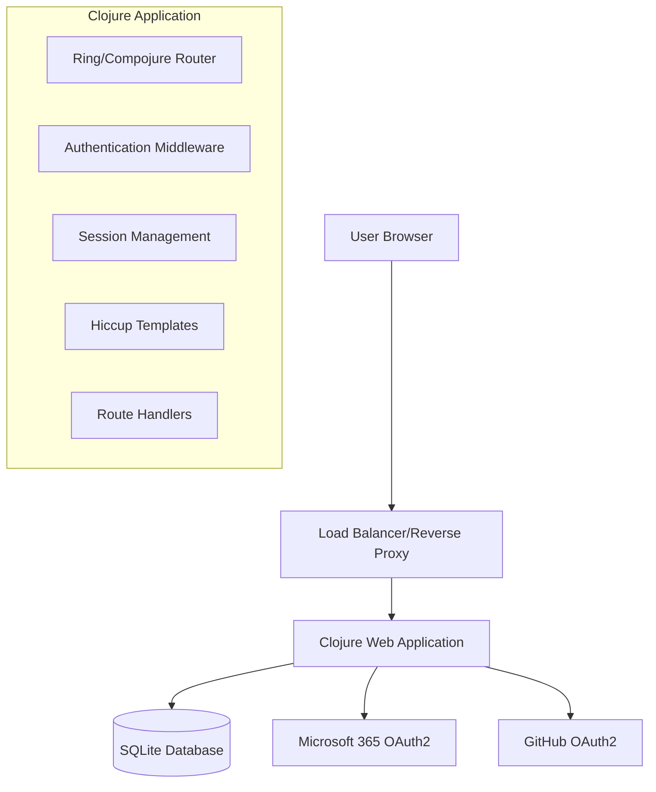

# Design Document

## Overview

The SSO Web Application is a Clojure-based web service that provides secure authentication through Microsoft 365 and GitHub OAuth2 providers. The application follows a traditional server-side rendered architecture using Ring/Compojure for HTTP handling, SQLite for data persistence, and Hiccup for HTML templating. The design emphasizes security, simplicity, and maintainability while providing a seamless user experience.

## Architecture

### High-Level Architecture



### Request Flow

1. **Authentication Flow**: User → Login Page → OAuth Provider → Callback → Session Creation → Dashboard
2. **Protected Resource Access**: User → Authentication Check → Resource Access or Login Redirect
3. **Logout Flow**: User → Logout Handler → Session Invalidation → Login Redirect

### Technology Stack

- **Web Framework**: Ring (HTTP abstraction) + Compojure (routing)
- **Database**: SQLite with clojure.java.jdbc
- **Templating**: Hiccup (Clojure-based HTML generation)
- **Authentication**: OAuth2 with ring-oauth2 middleware
- **Session Management**: Ring session middleware with secure cookies
- **Security**: CSRF protection, secure session handling
- **Testing**: clojure.test with ring-mock for HTTP testing

## Components and Interfaces

### Core Namespaces

#### `sso-web-app.core`
- **Purpose**: Application entry point and server lifecycle
- **Key Functions**:
  - `start-server`: Initialize and start the web server
  - `stop-server`: Gracefully shutdown the server
  - `init-app`: Initialize application components

#### `sso-web-app.routes`
- **Purpose**: HTTP route definitions and request routing
- **Key Routes**:
  - `GET /`: Login page (if not authenticated) or redirect to dashboard
  - `GET /login`: Display login page with OAuth provider options
  - `GET /auth/:provider`: Initiate OAuth flow for specified provider
  - `GET /auth/:provider/callback`: Handle OAuth callback
  - `GET /dashboard`: Protected user dashboard
  - `POST /logout`: Logout and session invalidation

#### `sso-web-app.auth`
- **Purpose**: Authentication and OAuth2 integration
- **Key Functions**:
  - `oauth-config`: OAuth2 provider configurations
  - `initiate-oauth`: Start OAuth flow with provider
  - `handle-callback`: Process OAuth callback and extract user info
  - `create-user-session`: Create authenticated session
  - `authenticated?`: Check if user is authenticated

#### `sso-web-app.db`
- **Purpose**: Database operations and user management
- **Key Functions**:
  - `init-db`: Initialize database schema
  - `create-user`: Create new user record
  - `find-user-by-provider-id`: Retrieve user by OAuth provider ID
  - `update-user`: Update user information

#### `sso-web-app.templates`
- **Purpose**: HTML template generation using Hiccup
- **Key Functions**:
  - `login-page`: Generate login page HTML
  - `dashboard-page`: Generate user dashboard HTML
  - `layout`: Common page layout wrapper

#### `sso-web-app.middleware`
- **Purpose**: Custom middleware for authentication and security
- **Key Functions**:
  - `wrap-authentication`: Authentication checking middleware
  - `wrap-csrf`: CSRF protection middleware
  - `wrap-security-headers`: Security headers middleware

### External Integrations

#### Microsoft 365 OAuth2
- **Authorization URL**: `https://login.microsoftonline.com/common/oauth2/v2.0/authorize`
- **Token URL**: `https://login.microsoftonline.com/common/oauth2/v2.0/token`
- **User Info URL**: `https://graph.microsoft.com/v1.0/me`
- **Scopes**: `openid profile email`

#### GitHub OAuth2
- **Authorization URL**: `https://github.com/login/oauth/authorize`
- **Token URL**: `https://github.com/login/oauth/access_token`
- **User Info URL**: `https://api.github.com/user`
- **Scopes**: `user:email`

## Data Models

### User Entity

```clojure
{:id          "UUID primary key"
 :provider    "oauth-provider (microsoft|github)"
 :provider-id "unique-id-from-provider"
 :username    "display-name"
 :email       "user-email"
 :created-at  "timestamp"
 :updated-at  "timestamp"}
```

### Session Entity

```clojure
{:session-id "UUID session identifier"
 :user-id    "reference to user ID"
 :created-at "session creation timestamp"
 :expires-at "session expiration timestamp"}
```

### Database Schema

```sql
CREATE TABLE users (
    id TEXT PRIMARY KEY,
    provider TEXT NOT NULL,
    provider_id TEXT NOT NULL,
    username TEXT NOT NULL,
    email TEXT,
    created_at DATETIME DEFAULT CURRENT_TIMESTAMP,
    updated_at DATETIME DEFAULT CURRENT_TIMESTAMP,
    UNIQUE(provider, provider_id)
);

CREATE TABLE sessions (
    session_id TEXT PRIMARY KEY,
    user_id TEXT NOT NULL,
    created_at DATETIME DEFAULT CURRENT_TIMESTAMP,
    expires_at DATETIME NOT NULL,
    FOREIGN KEY (user_id) REFERENCES users (id)
);

CREATE INDEX idx_sessions_expires ON sessions(expires_at);
CREATE INDEX idx_users_provider ON users(provider, provider_id);
```

## Error Handling

### Error Categories

1. **Authentication Errors**
   - OAuth provider errors (invalid credentials, network issues)
   - Session expiration or invalid sessions
   - CSRF token validation failures

2. **Database Errors**
   - Connection failures
   - Constraint violations
   - Transaction rollback scenarios

3. **Application Errors**
   - Invalid route parameters
   - Template rendering errors
   - Configuration errors

### Error Handling Strategy

```clojure
;; Global error handling middleware
(defn wrap-error-handling [handler]
  (fn [request]
    (try
      (handler request)
      (catch SQLException e
        (log/error e "Database error")
        {:status 500 :body "Database error occurred"})
      (catch Exception e
        (log/error e "Unexpected error")
        {:status 500 :body "Internal server error"}))))

;; OAuth-specific error handling
(defn handle-oauth-error [error-type error-description]
  (case error-type
    "access_denied" {:status 302 :headers {"Location" "/login?error=access_denied"}}
    "invalid_request" {:status 400 :body "Invalid OAuth request"}
    {:status 500 :body "OAuth authentication failed"}))
```

### Logging Strategy

- **Info Level**: Successful authentications, user sessions created/destroyed
- **Warn Level**: Failed authentication attempts, session expiration
- **Error Level**: Database errors, OAuth provider errors, unexpected exceptions
- **Debug Level**: Request/response details, OAuth flow steps

## Testing Strategy

### Unit Testing

1. **Database Layer Tests**
   - User CRUD operations
   - Session management
   - Database schema validation

2. **Authentication Logic Tests**
   - OAuth flow simulation
   - Session creation/validation
   - User profile extraction

3. **Template Rendering Tests**
   - HTML generation validation
   - Data injection verification
   - XSS prevention testing

### Integration Testing

1. **HTTP Route Tests**
   - End-to-end request/response testing using ring-mock
   - Authentication flow testing
   - Session management across requests

2. **Database Integration Tests**
   - Real database operations with test database
   - Transaction handling
   - Concurrent access scenarios

3. **OAuth Provider Integration Tests**
   - Mock OAuth provider responses
   - Error scenario handling
   - Token validation

### Security Testing

1. **CSRF Protection Testing**
   - Verify CSRF tokens are required for state-changing operations
   - Test CSRF token validation

2. **Session Security Testing**
   - Session fixation prevention
   - Secure cookie attributes
   - Session timeout handling

3. **Input Validation Testing**
   - SQL injection prevention
   - XSS prevention in templates
   - OAuth parameter validation

### Test Environment Setup

```clojure
;; Test configuration
(def test-config
  {:database {:url "jdbc:sqlite::memory:"}
   :oauth {:microsoft {:client-id "test-client-id"
                      :client-secret "test-secret"}
           :github {:client-id "test-client-id"
                   :client-secret "test-secret"}}
   :session {:secret "test-session-secret"}})

;; Test fixtures
(defn with-test-db [test-fn]
  (with-open [db (create-test-database)]
    (init-db db)
    (binding [*db* db]
      (test-fn))))
```

### Performance Considerations

1. **Database Optimization**
   - Proper indexing on frequently queried columns
   - Connection pooling for concurrent requests
   - Prepared statements for security and performance

2. **Session Management**
   - Efficient session storage and retrieval
   - Automatic cleanup of expired sessions
   - Minimal session data storage

3. **Template Rendering**
   - Template compilation caching
   - Minimal data processing in templates
   - Efficient HTML generation

4. **OAuth Integration**
   - Connection reuse for OAuth API calls
   - Proper timeout handling
   - Caching of OAuth provider configurations

This design provides a solid foundation for implementing a secure, maintainable SSO web application that meets all the specified requirements while following Clojure and web development best practices.